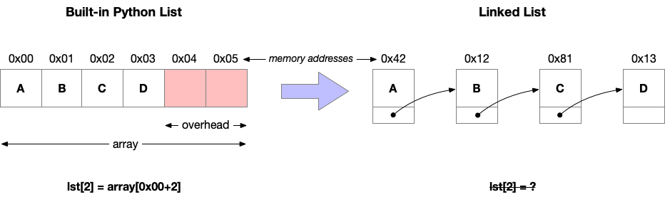
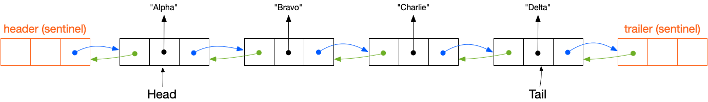

# Data Structures: Arrays

<br>

## Vocabulary

**Array:** a linear datatype and structure that stores elements of the *same* datatype in contiguous memory locations

+ **Referential Array:** elements ("references") are stored in a contiguous block of memory, and but the actual data objects are scattered and not necessarily next to each other

+ **Dynamic Array:** an array that can grow or shrink in size automatically at runtime, as elements are added or removed

+ **Static Array:** the actual data elements are stored in a single, contiguous block of memory

+ **Compact Array:** stores the actual data values directly next to each other in a contiguous block

+ **Matrix:** a arbitrary multidimensional array

**Tuple:** a datatype representing an ordered, immutable (unchangeable) collection of elements

**List:** a built-in datatype in python based on arrays that holds elements of *different* data types

**Vector:** an array that can change in size dynamically during runtime

**Linked List:** a type of list where the elements (nodes) are scattered throughout memory and linked by 'pointers'

+ **Singly Linked List:** a linear data structure in which the elements are not stored in contiguous memory locations; rather, each element is connected only to its next element using a pointer → we can traverse the entire linked list using the next pointer of each node

+ **Doubly Linked List:** the same as a singly linked list, except this uses nodes with data and two pointers (*next* and *previous*), allowing bidirectional traversal and easier deletion; this also requires more memory usage

<br>

*Visualization of a linked list:*


<br>

## Singly Linked Lists

Lear more about singly linked lists [**here**](https://www.geeksforgeeks.org/python/singly-linked-list-in-python/#what-is-a-singly-linked-list).  

```python
# Example 1 (GeeksforGeeks)

class Node:
    def __init__(self, data=None):
        # Data stored in the node
        self.data = data
        # Reference to the next node in the singly linked list
        self.next = None
```

```python
# Example 2 (Bauer's class)

class SinglyLinkedList:
    'A basic singly linked list implementation with tail and size'

    def __init__(self):
        self.head = None
        self.tail = None  # NEW: We have added this instance variable
        self.size = 0     # NEW: We have added this instance variable
    
    def add_first(self, element):
        'Add a new element at the head of the linked list'
        # 1. Create a node
        # 2. Set the node's next pointer to current head
        new_node = Node(element, self.head)
        # 3. Update the head pointer
        self.head = new_node

        # If the list was previously empty, we also need to update the
        # tail to point to the newly added node. That is needed because
        # the list only contains one node, and both head and tail should
        # point to that node.
        if self.size == 0:
            self.tail = new_node

        self.size += 1
    
    def remove_first(self):
        'Remove and return the first element from the head of the list'

        # First check if we have any elements in the list. If not, raise
        # the Empty exception (defined earlier for stacks and queues)
        if self.size == 0:
            raise Empty('The list is empty')

        # Save a reference to the current node at the head of the list
        node = self.head

        # Update the head pointer to point to the next element. If there
        # is no next element, it will be set to None
        self.head = self.head.next

        # Since node is no longer in the list, we can set its _next
        # reference to None to help the Python garbage collector
        node.next = None

        self.size -= 1

        # If we removed the last element from the list, we also need to
        # set the tail pointer to None, since there are no more nodes
        if self.size == 0:
            self.tail = None
        
        # Finally, return the node's value
        return node.element

    # NEW: Keeping a reference to the tail allows us to implement the
    # following method in constant time
    def add_last(self, element):
        'Add a new element at the tail of the linked list'
        # 1. Create a new node
        new_node = Node(element, None)

        # 2. Set the previous node's next to the new node

        if self.size == 0:
            self.head = new_node
        else:    
            self.tail.next = new_node        
            # 3. Update the tail pointer

        self.tail = new_node
        self.size += 1
```

### Implementing a stack in a singly linked list:
```python
class LinkedStack:
    def __init__(self):
        self._data = SinglyLinkedList()

    def push(self, el):
        self._data.add_first(el)

    def pop(self):
        return self._data.remove_first()

stack = LinkedStack()
stack.push(42)
stack.push("alpha")
stack.push("python")

print(stack.pop()) # expecting: python
print(stack.pop()) # expecting: alpha
print(stack.pop()) # expecting: 42
```

### Implementing a queue with a singly linked list
```python
class LinkedQueue:
    def __init__(self):
        self._data = SinglyLinkedList()
    
    def enque(self, el):
        self._data.add_last(el)

    def deque(self):
        return self._data.remove_first()

queue = LinkedQueue()
queue.enque(42)
queue.enque("alpha")
queue.enque("python")

print(queue.deque()) # expecting: 42
print(queue.deque()) # expecting: alpha
print(queue.deque()) # expecting: python
```

<br>

## Doubly Linked Lists

**Sentinels:** fixed empty nodes before head and after tail of a linked list in a *doubly linked lists*; these guarantee that every node has a previous node and that every node has a next node, including the head and the tail

*Visualization of doubly linked list with sentinels:*


Lear more about doubly linked lists [**here**](https://www.geeksforgeeks.org/dsa/doubly-linked-list/)


### Extending the node class in doubly linked lists:
```python
class Node:
    def __init__(self, element, prev, next):
        self.element = element
        self.next = next
        self.prev = prev
```


#### The correct way to create a matrix:
```python
from copy import deepcopy

def make_matrix(col, row):
    return [[0] * col for j in range(row)]

new_row = [0] * col
matrix = []
for j in range(row): 
    my_row = deepcopy(new_row)
    matrix.append(my_row)

matrix = make_matrix(5,3)

# Let's try to modify a single cell within the matrix
matrix[2][0] = 42

# Print the matrix to see the result
print(matrix)
```
