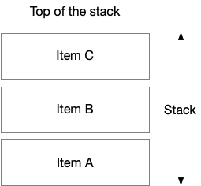
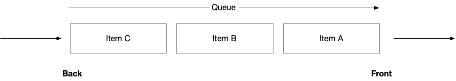
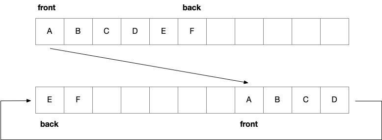

# Data Structures & Operations

In Python, some basic operations we can do on elements in a data structure (specifically, arrays) include **integer indexing**, **insertion**, **removal**, and **appendation**. This guide will expand on more operations we can implement using *imported modules*.

## Vocabulary

**Abstract Data Type:** defines the data and operations (methods) on the data, like a contract between the data structure and the programmer → we will model abstract data types with *classes*

**DeepCopy:** a built-in function in Python that creates a completely independent clone of an object, including all objects it refers to, recursively

**NumPy:** a standard package for numeric computing in Python

+ The basic data type in is the numpy *n-dimensional* array; these can be used to represent *vectors* (1D), *matrices* (2D), or *tensors* (nD)

**Read more about** ***Shallow and Deep Copy Operations*** [**here**](https://docs.python.org/3/library/copy.html).

**Array:** a linear datatype and structure that stores elements of the *same* datatype in contiguous memory locations

+ **Matrix:** a arbitrary multidimensional array (e.g. a tic-tac-toe board)

+ **Referential Array:** elements ("references") are stored in a contiguous block of memory, and but the actual data objects are scattered and not necessarily next to each other → elements stored as contiguous sequence of *references* to themselves, rather than storing the actual elements directly

<br>

For representing multidimensional data, we would use a *matrix*, but the underlying structure of matrices still stores elements in the form of a *referential array*:

#### The correct way to create a matrix:
```python
from copy import deepcopy

def make_matrix(col, row):
    return [[0] * col for j in range(row)]

new_row = [0] * col
matrix = []
for j in range(row): 
    my_row = deepcopy(new_row)
    matrix.append(my_row)

matrix = make_matrix(5,3)

# Let's try to modify a single cell within the matrix
matrix[2][0] = 42

# Print the matrix to see the result
print(matrix)
```

```python
li = [1,2,3]

# shallow copy
test = li

# deep copy  
test = li[:]

x = [1,2,3]
y = [4,5,6]
z = [7,8,9]

li = [x,y,z]
test = li 

# shallow copy - inner lists are not duplicated 
li2 = li[:] 


li[0][0] = 0 
li
```

### Multidimensional arrays are made much simpler by using the *NumPy* module:
```python
# Creating multidimensional arrays using numpy.array is straightforward
matrix = numpy.array([[0, 0, 0], [0, 0, 0], [0, 0, 0]])

# See the result
print(matrix)
type(matrix)

```
+ 1-dimensional NumPy arrays are often used to represent a series of data
+ n-dimensional arrays often represent complete data sets (each column is a type of measurement)
+ NumPy arrays are very similar to Python lists because indexing and slicing works the same way (including assingments); unlike a Python list, however, all cells in the same NumPy array must contain the same data type

Many Python built-in operators have been overloaded for NumPy arrays to make working with vectors, matrices, and tensors easy. Because of this, it's also easy to compute descriptive statistics for a series of data:
```python
u.max(), u.min(), u.mean(), u.std() # maximum, minimum, mean, standard deviation
```
The parameter **dtype="uint64"** tells NumPy what data types cells should use. NumPy arrays are homogeneous, and each cell has a maximum value that it can store which is determined by the data type.
```python
rows = 4
cols = 3
matrix = numpy.zeros((rows, cols), dtype="uint8") # row x col matrix filled with zeros

print(matrix)
#matrix[2][0] = 42
matrix[2,0] = 255
print(matrix)
```

We can create an array using *literals* (notation in the source code that represents a fixed data value directly):
```python
# Creates a double array directly using literals
m = numpy.array([[1,2,3]])
m.shape
```
```python
# Creates a single array directly using literals
m = numpy.array([1,2,3])
m.shape
```
We can also reshape the array in different ways:
```python
# Creates a 2D vector
m = numpy.array(range(27))
m

# OUTPUT: array([ 0,  1,  2,  3,  4,  5,  6,  7,  8,  9, 10, 11, 12, 13, 14, 15, 16,
#       17, 18, 19, 20, 21, 22, 23, 24, 25, 26])
```
```python
# Reshapes the vector into a 3D array
m2 = m.reshape((3,3,3))
m2

'''OUTPUT: array([[[ 0,  1,  2],
        [ 3,  4,  5],
        [ 6,  7,  8]],

       [[ 9, 10, 11],
        [12, 13, 14],
        [15, 16, 17]],

       [[18, 19, 20],
        [21, 22, 23],
        [24, 25, 26]]])
'''
```
Learn more about the NumPy module [**here**](https://numpy.org/).


## Stacks

Stacks are one of the most fundamental and useful data structures. They have the following characteristics:

+ It is a collection of items (not necessarily of the same types)

+ New items can be inserted (**pushed**) at any time (the size is unbounded)

+ Only the most recently inserted item can be accessed (i.e. no indexing)

+ Only the most recently inserted item can be removed (**popped**)

+ The most recently inserted item is called the **top** of the stack

+ We say a stack follows the **last in, first out (LIFO)** principle (i.e. the most recently pushed item is the one popped next)

*Visualization of a stack:*



```python
stack = []
stack.append("A") # use append instead of push
stack.append("B")
stack.append("C")
print(stack.pop())
print(stack.pop())
print(stack.pop())

stack.pop()
```

Some of these operations function similarly as they would in lists, but we use different commands for stacks:

| ***Stacks***    | ***Lists*** |
| -------- | ------- |
| S.push(e)| L.append(e)|
| S.pop()  | L.pop() |
| S.top()    | L[-1] |
| S.is_empty() | len(L) == 0 |
| S.len() | len(L) |


### Stack operations:
```python
class Empty(Exception):
    '''Exception raised by stack operations on error

    This exception is raised by the stack pop() operation when the stack is empty, i.e.,
    there is nothing to pop.
    '''    
    pass

class Stack:
    '''This class represents the stack abstract data type

    The methods below have empty bodies. We will implement them later in an actual
    stack implementation based on a Python list.
    '''
    
    def push(self, e):
        'Add element e to the top of the stack' 
        pass

    def pop(self):
        'Remove and return the top element from the stack. Raise error if the stack is empty'
        pass

    def top(self): # also known as peek()
        'Return a reference to the top (without removing it)'
        pass

    def is_empty(self):
        'Return True if the stack is empty and false otherwise'
        pass

    def __len__(self):
        'Return the number of elements in the stack'
        pass
```

### Implementing a stack with lists:
```python
class ArrayStack(Stack):
    'A stack implementation that stores elements in a built-in Python list'
    
    def __init__(self):
        'Creates a new stack instance backed by a built-in Python list'
        self._data = list()
    
    def push(self, e):
        'Add element e to the top of the stack'
        self._data.append(e)

    def pop(self):
        'Remove and return the top element from the stack. Raise error if the stack is empty'
        if len(self._data) == 0:
            raise Empty('The stack is empty')

        return self._data.pop()
    
    def top(self):
        'Return a reference to the top (without removing it)'        
        if len(self._data) == 0:
            raise Empty('The stack is empty')
        
        return self._data[-1]

    def is_empty(self):
        'Return True if the stack is empty and false otherwise'
        return len(self._data) == 0

    def __len__(self):
        'Return the number of elements in the stack'
        return len(self._data)

    def __repr__(self): 
        return str(self._data)
```

```python
s = ArrayStack()
s.push(8)
s.push(2)

# Prints [8, 2]
print(s) # this technically calls print(str(s)) which is print(s.__str__()) 
```

```python
s.is_empty()    # Should return False
len(s)      # Should return 2
```

Learn more about stacks [**here**](https://www.geeksforgeeks.org/python/stack-in-python/).

Learn more about stack implementation using a ***linked list*** [**here**](https://www.geeksforgeeks.org/dsa/implement-a-stack-using-singly-linked-list/).


## Queues

Queues are another fundamental data structure. The queues is very similar to a stack:

+ It follows the **first-in, first-out (FIFO)** principle (i.e. elements enter the queue from the back and are removed from the front)

+ Holds a collection of items (not necessarily of the same types)

+ New items can be inserted (**enqueued**) at any time (the size is unbounded)

+ Only the oldest item can be accessed (i.e. no indexing)

+ Only the oldest item can be removed (**popped**)

+ The item that has been on the queue the longest is called the **front**

+ The most recently added item is called the **back**

*Visualization of a queue:*



```python
queue = []
queue.append("A") # we use append instead of enqueue
queue.append("B")
queue.append("C") 

queue.pop(0)  # we use pop(0) instead of dequeue 
```

### Queue operations:
```python
class Queue:
    'The queue abstract data type'
    
    def enqueue(self, e):
        'Add element e to the back of the queue'
        pass

    def dequeue(self):
        'Remove and return (first) element from the front of the queue'
        pass

    def first(self):
        'Return a reference to the first element in the queue'
        pass

    def is_empty(self):
        'Return true if the queue is empty'
        pass

    def __len__(self):
        'Return the number of elements in the queue'
        pass
```

### Implementing a queue with fixed-size circular lists:

Unfortunately, a naive array-based implementation of a queue has a very slow asymptotic runtime, which could be computationally costly. Instead, we would can implement a queue much faster using a *fixed-size circular list.*

+ Allow the front of the queue to move right

+ Allow the contents to wrap around like a circle

*Visualization of a fixed-size circular list:*



To actually implement this, we can store our elements in a list like before, but let's make the list *fixed-size* for now, i.e., it will not be enlarged or shrunken. This also means our queue will have a maximum size. We will also keep track of the index of the front element (it will not necessarily be 0). We will also keep the number of elements in the queue in a separate variable. Since we will not necessarily have items starting at index 0, we can no longer rely on the length of the list for queue size.

+ The abstract data type is the ***queue***

+ The implementation is a ***fixed-size circular list***

+ In praxis, you don't need to implement a linked-list queue yourself → **collections.deque** is built on a linked list

    + **collections.deque:** (pronounced "deck", short for "double-ended queue") a specialized, optimized container in Python for adding and removing elements from both ends with efficient, thread-safe operations

```python
class Full(Exception):
    'An exception raised when the queue is full'
    pass

class CircularListQueue:
    'A queue implementation using a fixed-size Python list to store elements'
    
    DEFAULT_SIZE = 10  # When creating a new queue, create an empty list of this size

    def __init__(self):
        'Create a new empty queue instance'
        self._data = [ None ] * CircularArrayQueue.DEFAULT_SIZE   # Create a list of DEFAULT_SIZE None values
        self._front = 0    # Initialize the reference to the front of the queue
        self._back = 0     # Initialize the reference to the back of the queue
        self._size = 0     # Logical number of elements. Initially, the queue is empty
    
    def enqueue(self, e):
        'Add an element to the back of the queue'

        # First, check if the queue is full. If it is, raise an exception
        if self._size == len(self._data):
            new_size  = CircularArrayQueue.DEFAULT_SIZE * 2
            new_data = [None] * new_size

            new_back = 0             
            for i in range(len(self)): 
                el =  self.data_[self._front]
                self._front = (self._front + 1) % CircularArrayQueue.DEFAULT_SIZE
                new_data[new_back] = el 
                new_back += 1

            self._data = new_data
            self._front = 0
            self._back = new_back

            
            #raise Full('The queue is full')

        # If it is not, add the item at the back
        self._data[self._back] = e

        # Advance the back pointer modulo the size of the circular list.
        # The modulo operation will make the value wrap around if necessary.
        self._back = (self._back + 1) % CircularArrayQueue.DEFAULT_SIZE

        # And increase the size of the queue
        self._size += 1
    
    def dequeue(self):
        'Remove an element from the front of the queue'

        # First, make sure the queue is not empty
        if len(self._size) == 0:
            raise Empty('The queue is empty')

        # Get the front element
        el = self._data[self._first]

        # Erase the value from the list to help the garbage collector
        self._data[self._front] = None

        # Decrease the size of the queue
        self._size -= 1

        # Update the pointer to the front. Use modulo arithmetic to wrap around
        self._front = (self._front + 1) % CircularArrayQueue.DEFAULT_SIZE

        # Return the previously retrieved element
        return el

    def first(self):
        'Return a reference to the first element in the queue'
        if self._size == 0:
            raise Empty('The queue is empty')

        # Return a reference to the first element in the queue
        return self._data[self._front]

    def is_empty(self):
        'Return true if the queue is empty'
        if self._size == 0:
            return True
        else:
            return False

    def __len__(self):

        return len(self._size)
```

Learn more about queue implementation using circular linked lists [**here**](https://www.geeksforgeeks.org/dsa/circular-linked-list-implementation-of-circular-queue/).


